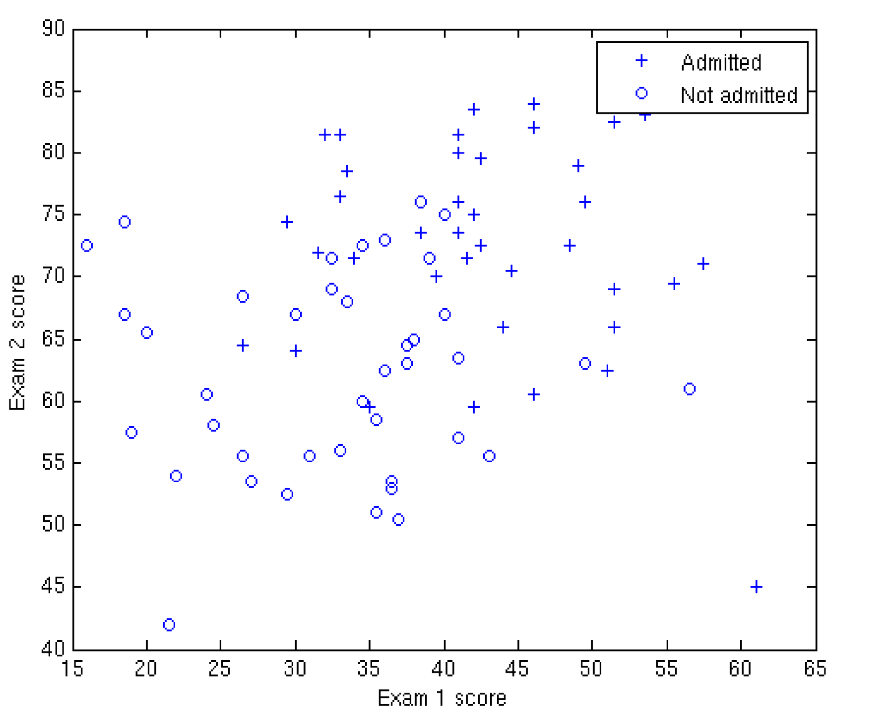
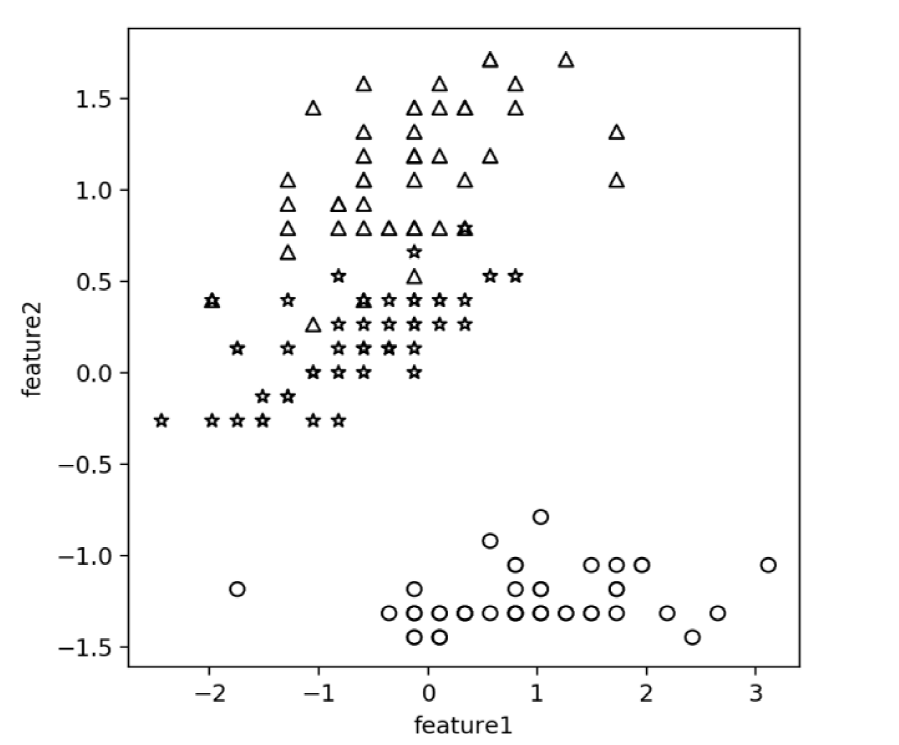

<div align=center>
    <div style="font-size:48px">
        <b>Machine Learning Course</b>
    </div>
</div>


## Project 1: 
### Nanjing Housing Price Prediction

- Given history data:  

```python
Year 𝑥 = [2000, 2001, 2002, 2003, 2004, 2005, 2006, 2007, 2008, 2009, 2010, 2011, 2012, 2013]      

Price 𝑦 = [2.000, 2.500, 2.900, 3.147, 4.515, 4.903, 5.365, 5.704, 6.853, 7.971, 8.561, 10.000, 11.280, 12.900]
```

- Assumption:     
the price and year are in a linear relation, thus they could be modeled by linear regression    

- Task:    
    1. To get the relationship of 𝑥 and 𝑦 by using linear regression, based on 1) close-form solution and 2) gradient descent;
    2. To predict the Nanjing housing price in 2014.    

## Project 2: 
### Logistic Regression

- Given the following training data: 

<div align=center>
    
</div>

<div align=center>
    http://openclassroom.stanford.edu/MainFolder/DocumentPage.php?course=DeepLearning&doc=exercises/ex4/ex4.html
</div>

1. Implement 1) GD; 2) SGD; 3) Newton‘s Method for logistic regression, starting with the initial parameter 𝜽=0.    
2. Determine how many iterations to use, and calculate for each iteration and plot your results.    

## Project 3: 
### Softmax Regression    

- Given the following training data: 

<div align=center>
    
    
</div>

<div align=center>
    (1)http://openclassroom.stanford.edu/MainFolder/DocumentPage.php?course=DeepLearning&doc=exercises/ex4/ex4.html    
    (2)https://pan.baidu.com/s/1gU81bKsIj8cRokOYEk1Jzw password: w2a8
</div>

1. For data set (1), implement logisticregression and softmaxregression with 1) GD; 2) SGD;
2.  For data set (2), implement softmaxregression with 1) GD; 2) SGD;
3. Compare logistic regression and softmaxregression.

## Practice 4: 
### Perceptron

- Given the following training data: 

<div align=center>
    
    
</div>

<div align=center>
    (1)http://openclassroom.stanford.edu/MainFolder/DocumentPage.php?course=DeepLearning&doc=exercises/ex4/ex4.html    
    (2)https://pan.baidu.com/s/1gU81bKsIj8cRokOYEk1Jzw password: w2a8
</div>

1. For data set (1), implement perceptron algorithm and compare it withlogistic regression (SGD);
2. For data set (1), implement multi-class perceptron algorithm and compare it withstandard perceptron (SGD);
3. For data set (2), implement multi-class perceptron algorithm and compare it with softmaxregression (SGD).

## Practice 5-6: 
### 3-layer Forward NN with BP

- Given the following training data: 

<div align=center>
    
    
</div>

<div align=center>
    (1)http://openclassroom.stanford.edu/MainFolder/DocumentPage.php?course=DeepLearning&doc=exercises/ex4/ex4.html    
    (2)https://pan.baidu.com/s/1gU81bKsIj8cRokOYEk1Jzw password: w2a8
</div>

1. For both data sets, Implement 3-layer Forward Neural Network with Back-Propagation and report the 5-fold cross validation performance (code by yourself, don’t use toolkits, e.g., Tensorflowand PyTorch);
2. Compare your ANN with logistic regression on data set (1), and softmaxregression on data set (2), and draw the classification boundaries for all datasets and algorithms.
3. For both data sets, implement multi-layer Forward Neural Network with Back-Propagation and report the 5-fold cross validation performance (code by yourself);
4. Do that again (by using Tensorflowor PyTorch);
5. Tune the model by using different numbers of hidden layers and hidden nodes, different activation functions, different cost functions, different learning rates.

## Practice 7: 
### Naïve Bayes for Text Classification

- Implement naïve Bayes algorithm with
    1. Multinomial event model
    2. Multi-variateBernoulli model

- Running the algorithm on the Tsinghua text classification data set (http://www.nustm.cn/member/rxia/ml/data/Tsinghua.zip) and report the classification accuracy.

- Implement softmaxregression based on the Bag-of-words (BOW) representation and two kinds of term weighting methods (term frequency and presences).

- Compare the naïve Bayes and softmaxregression, from the perspective of model and results.

